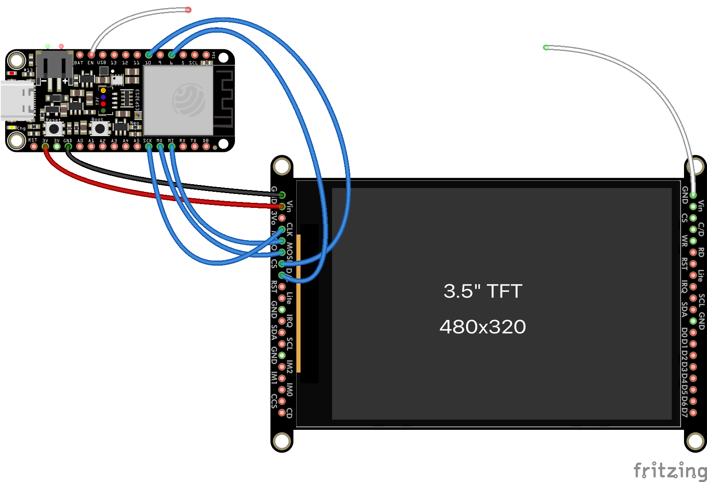

# ESP32 CircuitPython picture frame

This project uses an LCD in a 3D printed enclosure as a digital photo frame. It automatically updates
when the image itself changes.

## What you need

To build this, you need these supplies:

* [Adafruit ESP32-S3 Feather (4MB Flash/2MB PSRAM)](https://www.adafruit.com/product/5477)
* An Adafruit 320x480 LCD with SPI interface, either with [resistive touch](https://www.adafruit.com/product/2050) or [capacitive touch](https://www.adafruit.com/product/5846); this project was built with the latter
* A [mini push-button switch](https://www.adafruit.com/product/3870)
* [22AWG hookup wire](https://www.adafruit.com/product/1311)
* Four [M3x4 screws](https://www.amazon.com/gp/product/B0CSX4L42C)
* Four [M2.5x4 screws](https://www.amazon.com/gp/product/B0BC9294PD)
* Two [M2x4 screws](https://www.amazon.com/gp/product/B0B6HVS3SJ)
* Four [_self-tapping_ M2x4 screws](https://www.amazon.com/gp/product/B09DB5SMCZ)
* [Adafruit 2500mAh battery](https://www.adafruit.com/product/328); if you intend to keep the frame plugged in 24/7, then you can omit this
* Solder
* 3D printing filament
* USB C cable

...and these tools:

* Little screwdriver
* Soldering iron
* 3D printer
* Thin double-sided tape

## 3D printing

Print `Enclosure.stl` face down and `Backplate.stl` as is. Do not use supports. Infill settings don't matter. Use 0.2mm to 0.3mm layer height, but not variable layer height.

## Software setup

1. [Install the latest stable version of CircuitPython onto the Feather](https://learn.adafruit.com/adafruit-esp32-s3-feather/circuitpython).
2. Copy `settings.toml.example` to `settings.toml` and, in `settings.toml`, change the variables to their applicable values. At a minimum, you must set `IMAGE_ENDPOINT` to the URL of the image to download. This URL should, but doesn't have to, include `ETag` HTTP headers so the image is only rendered if it changed since the last request.
3. Copy `wifi.json.example` to `wifi.json` and, in `wifi.json`, change the variables to their applicable values. You can add multiple Wi-Fi SSIDs to the JSON array to support multiple connections if you move the picture frame to different locations.
4. Copy `code.py`, `boot.py`, the entire `lib` directory, and your new `wifi.json` and `settings.toml` files to the `CIRCUITPY` drive, and unplug the Feather when you're done.

## Assembly

Read this whole section before starting actual assembly so you'll understand how much wire to use and how things are laid out. It's a tight fit.

First, _loosely_ screw the power switch to the backplate with the button facing downward (i.e., outside the baseplate so it's user-accessible). Only screw in the screws enough so they don't fall out; leave plenty of slack.

Solder the components together like this. Note the loose white `EN` and `GND` wires for the next step; only solder one end to their respective boards for now.

The connections are as follows:

| From Feather pin | To LCD pin |
|------------------|------------|
| `3V`             | `Vin`      |
| `GND`            | `GND`      |
| `SCK`            | `CLK`      |
| `MO`             | `MOSI`     |
| `MI`             | `MISO`     |
| `10`             | `CS`       |
| `6`              | `D/C`      |

Screw the LCD with the screen facing outward into the enclosure with M3 screws. Screw the Feather into the backplate with M2.5 screws for the holes by the USB C port and M2 screws for the holes by the Wi-Fi antenna.

Strip off some insulation from the two free white wires and wrap them around the screws for the power switch, then tighten the screws. Don't overtighten them and strip the plastic threads. If necessary, you can use metal washers to improve the contact area. This is similar to how you would wire up the screw terminals on a household North American switch or power outlet.

If using the battery, use double-sided tape to secure it to the backplate, then plug it into the Feather. This might turn on the Feather.

Sandwich the two parts together and use the self-tapping M2 screws to hold them together. The parts should easily align. If they don't or the backplate is bending, check your wire routing to make sure there's enough clearance between the two.

Plug in the Feather to your computer.

If it doesn't turn on, toggle the power switch. Note the power is _on_ when the power switch is _off_ (no continuity) and vice versa. That is, connecting `EN` to `GND` shuts _off_ the Feather, and disconnecting `EN` and `GND` turns _on_ the Feather.

It might take a few seconds for the image to appear on the screen.

## Troubleshooting

For almost all problems, [connect to the CircuitPython serial console](https://learn.adafruit.com/welcome-to-circuitpython/kattni-connecting-to-the-serial-console) to see the code's output. It is quite likely there is an error message there to help you.

* Is the LCD off completely (no backlight), or showing garbled data? Check your wiring and power source. If unplugged, the battery may have died.
* Is the LCD showing just a white screen? It's probably crashing at startup for any number of reasons; check the serial console.
* Did you set up `settings.toml` with `IMAGE_ENDPOINT`? Does the endpoint URL include the protocol (`http://` or `https://`)? If using SSL, are you using a valid certificate signed by a public CA and not a self-signed certificate?
* Did you set up `wifi.json` with valid credentials?
* Is your image URL a valid `.jpg` or `.png`? You can use a `.bmp` too, but it'll be much slower to download.
* Is your image URL accessible from the Feather's Wi-Fi connection? If using DNS, make sure it can resolve. Make sure your endpoint URL is accessible from the same subnet the Feather is using for its connection.
* Is the image not scaling to the screen (too big or too small)? Resize it to 480x320 pixels?
* Is the image refreshing frequently even when it hasn't changed? See if your server is including an `ETag` header in its response.
* Is the image not refreshing even when the endpoint's image has? Adjust `REFRESH_INTERVAL_SECONDS` to be more frequent in `settings.toml` if necessary; this is how often the image is downloaded and rendered if it changed. Also make sure, if the server includes an `ETag` header in its response, that the value changes when the image changes.